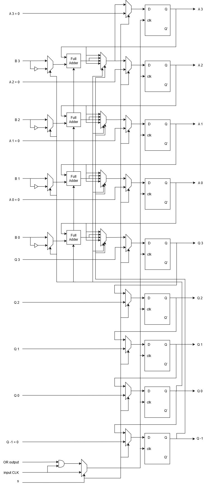
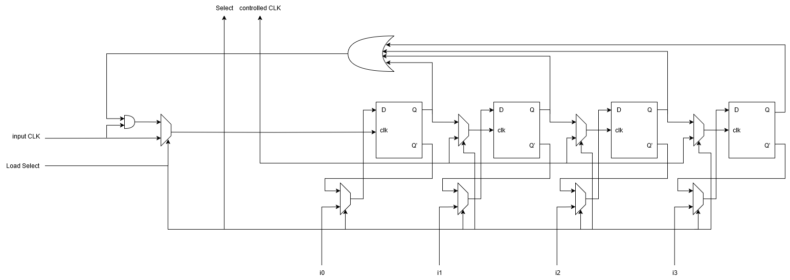
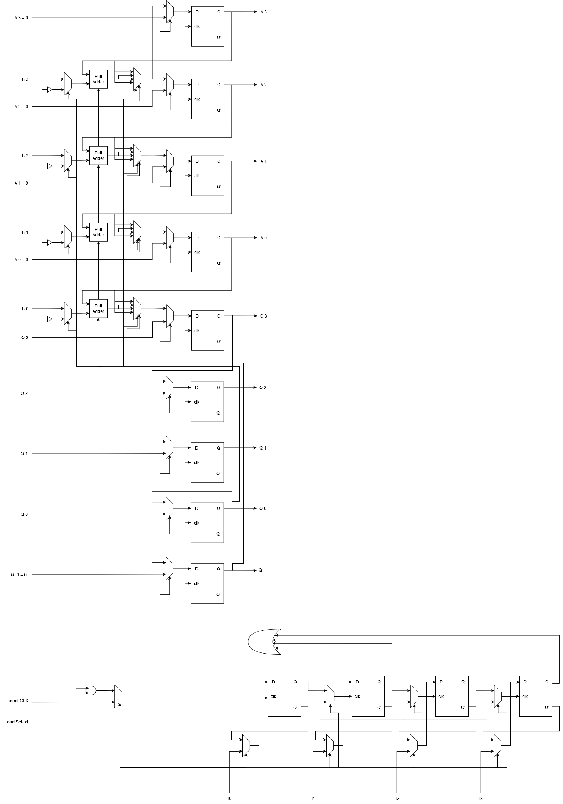

# Booth Multiplication VHDL Project

A VHDL implementation of Booth Multiplication algorithm, designed and simulated for a university Digital Systems course.

This repository contains a university course project focused on designing and implementing Booth’s algorithm for signed binary multiplication. This university course project was developed in January 2025. The design was implemented in VHDL and verified through simulation using Xilinx ISE.

## Booth Multiplication Design

## Features

- Booth Multiplication algorithm implementation
- Synthesizable VHDL design
- Signed binary multiplication support
- Parameterized n-bit multiplier architecture
- Structural VHDL implementation using modular components
- Functional simulation and verification
- Testbench-based validation

## Tech Stack

- VHDL
- Xilinx ISE